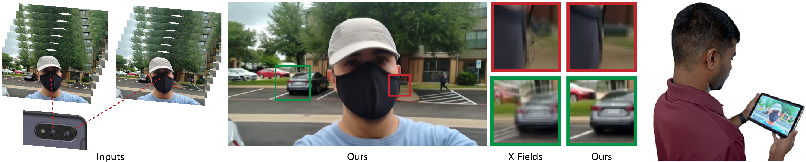

# StereoMPD


> Implicit View-Time Interpolation of Stereo Videos using Multi-Plane Disparities and Non-Uniform Coordinates  
> [Avinash Paliwal](http://avinashpaliwal.com/), 
> [Andrii Tsarov](https://www.linkedin.com/in/andrii-tsarov-b8a9bb13), 
> [Nima Khademi Kalantari](http://nkhademi.com/)   
> CVPR 2023

[Project](https://people.engr.tamu.edu/nimak/Papers/CVPR23StereoVideo/index.html) | [Paper](https://arxiv.org/pdf/2303.17181) | [Video](https://www.youtube.com/watch?v=XJa_bf8OCrc)  

  

## Code coming soon

## Citation
```
@inproceedings{Paliwal2023implicit,
  author    = {Paliwal, Avinash and Tsarov, Andrii and Kalantari, Nima Khademi},
  title     = {Implicit View-Time Interpolation of Stereo Videos using Multi-Plane Disparities and Non-Uniform Coordinates},
  booktitle = {Proceedings of the IEEE Conference on Computer Vision and Pattern Recognition},
  year      = {2023},
}
```